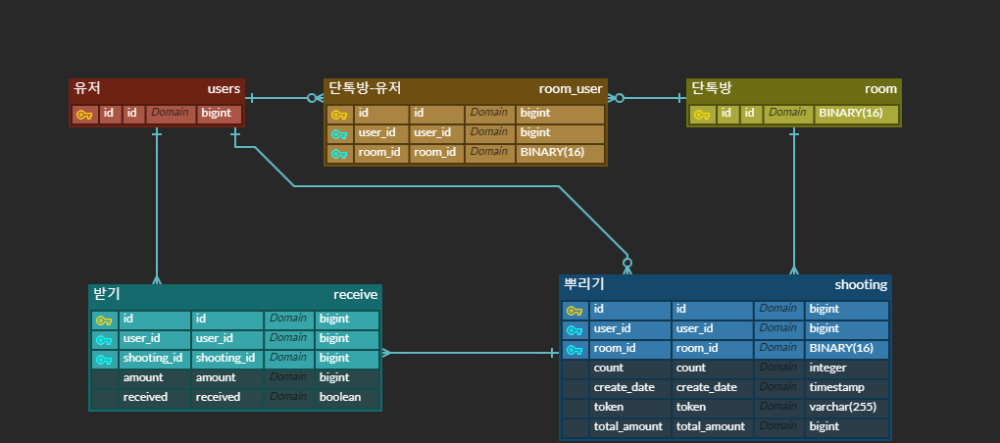

# 카카오페이 머니뿌리기 기능 구현

머니뿌리기 기능(뿌리기, 받기, 조회 기능을 수행하는 REST API 를 구현)
---
* 사용자는 다수의 친구들이 있는 대화방에서 뿌릴 금액과 받아갈 대상의 숫자를 입력하여 뿌리기 요청을 보낼 수 있습니다.
* 요청 시 자신의 잔액이 감소되고 대화방에는 뿌리기 메세지가 발송됩니다.
* 대화방에 있는 다른 사용자들은 위에 발송된 메세지를 클릭하여 금액을 무작위로 받아가게 됩니다. 
> 유저와 단톡방 정보는 HTTP Header로 전달됩니다   
> 모든 사용자는 뿌리기에 충분한 잔액을 보유하고 있다고 가정하여 별도로 잔액에 관련된 체크는 하지 않습니다.   

ERD
---



***


에러메세지(ErrorMessage)
---
```java
    E001("뿌릴 금액은 뿌릴 인원수보다 커야합니다.", HttpStatus.BAD_REQUEST),
    E002("잘못된 대화방 입니다.", HttpStatus.BAD_REQUEST),
    E003("잘못된 유저 또는 대화방 입니다.", HttpStatus.BAD_REQUEST),
    E004("참여중인 대화방 에서만 가능합니다.", HttpStatus.NOT_ACCEPTABLE),
    E005("뿌릴 인원수의 최대값은 대화방 인원수 입니다.", HttpStatus.NOT_ACCEPTABLE),
    E006("token 길이는 3이어야 합니다.", HttpStatus.BAD_REQUEST),
    E007("잘못된 token 입니다.", HttpStatus.BAD_REQUEST),
    E008("종료된 뿌리기 입니다.", HttpStatus.NOT_ACCEPTABLE),
    E009("자신이 뿌린건 받을 수 없습니다.", HttpStatus.NOT_ACCEPTABLE),
    E010("이미 받았습니다", HttpStatus.NOT_ACCEPTABLE),
    E011("본인이 뿌린 건만 조회할 수 있습니다.", HttpStatus.NOT_ACCEPTABLE),
    E012("뿌린 건에 대한 조회는 7일 동안만 할 수 있습니다.", HttpStatus.NOT_ACCEPTABLE);
```


HTTP Header
---
* 사용자와 단톡방 정보가 유효한지, 유저가 해당 단톡방에 들어있는지 체크합니다.

|이름|내용|타입|예시|
|---------|------|--------------|-------------------------------------|
|X-USER-ID|유저ID|Long|1|
|X-ROOM-ID|단톡방ID|String(UUID)|78465199-f4e6-41fc-8c70-dbca648b23f4|

> ```E002``` UUID type이 잘못된 경우   
> ```E003``` 유효한 유저/단톡방이 아닌경우   
> ```E004``` 유저가 단톡방에 들어있지 않은 경우    

***


 1.뿌리기 (POST /api/v1/shooting)
---
* Request Body

|이름|내용|타입|예시|
|------|------|-------|-----------------------|
|amount|뿌릴금액|long|1000000|
|count|뿌릴인원|int|5|

1. 뿌릴 금액, 뿌릴 인원을 요청값으로 받습니다.
2. 에러체크
> ```E001``` 뿌릴 인원이 뿌릴 금액보다 큰 경우   
> ```E005``` 뿌릴 인원이 단톡방 인원보다 큰 경우   
3. 뿌리기 생성 및 token 생성(3자리 문자열 랜덤값)
4. 뿌릴 금액을 인원수만큼 랜덤으로 고르게 분배해서 받기에 저장
```java
private long[] distribute(long amount, int count) {
    int[] dis = new int[count];

    int disSum = 0;
    Random random = new Random();
    for (int i = 0; i < count; i++) {
        dis[i] = random.nextInt(100000) + 1;
        disSum += dis[i];
    }

    long[] amounts = new long[count];
    long amountSum = 0L;
    for (int i = 0; i < count; i++) {
        amounts[i] = (long) (dis[i] / (float) disSum * amount);
        amountSum += amounts[i];
    }

    if(amountSum != amount) {
        amounts[random.nextInt(count)] += (amount - amountSum);
    }

    return amounts;
}
```
5. 만든 token값 return   

* 결과
```json
{
    "success": true,
    "response": "NGV",
    "error": null
}
```


2.받기 (PUT /api/v1/shooting)
---
* Request Param

|이름|내용|타입|예시|
|------|------|-------|----------------|
|token|token|String|AB1|

1. 뿌리기의 token값을 요청값으로 받습니다.
2. 에러체크
> ```E006``` token 길이가 3이 아닌 경우   
> ```E007``` 유효한 token이 아닌 경우   
> ```E008``` 10분이 경과한(종료된) 경우   
> ```E009``` 뿌린 유저와 동일한 경우   
> ```E010``` 이미 받은 경우   
3. receive중 부여되지 않은 것(received = false) 중 하나 부여
4. 부여한 금액 return

* 결과
```json
{
    "success": true,
    "response": 304836,
    "error": null
}
```


3.조회 (GET /api/v1/shooting)
---
* Request Param

|이름|내용|타입|예시|
|------|------|-------|----------------|
|token|token|String|AB1|

1. 뿌리기의 token값을 요청값으로 받습니다.
2. 에러체크
> ```E006``` token 길이가 3이 아닌 경우   
> ```E007``` 유효한 token이 아닌 경우   
> ```E011``` 뿌린 유저가 본인이 아닌 경우   
> ```E012``` 뿌리고 7일이 경과한 경우   
3. 해당 뿌리기의 receive 중 부여된 것(received = true)의 목록을 조회

* Response Body

|이름|내용|타입|예시|
|----------|------|-------|-----------------------|
|createDate|뿌린시간|LocalDateTime|2020-08-14T00:00:00|
|totalAmount|뿌린금액|long|1000000|
|receivedAmount|받기완료된금액|long|100000|
|receiveList|받기완료된정보|List<이하>||

|이름|내용|타입|예시|
|------|--------|-------|-----------|
|amount|받은금액|long|2351|
|userId|받은유저ID|long|1|

* 결과(Success)
```json
{
    "success": true,
    "response": {
        "createDate": "2020-08-14T06:08:59",
        "totalAmount": 1000000,
        "receivedAmount": 304836,
        "receiveList": [
            {
                "amount": 304836,
                "userId": 9
            }
        ]
    },
    "error": null
}
```

* 결과(Fail)
```json
{
    "success": false,
    "response": null,
    "error": {
        "message": "잘못된 token 입니다.",
        "status": 400
    }
}
```


***


테스트
---
* Init Data
  * 유저 10명, 단톡방 2개 생성
  * 1-5번 유저는 1번 단톡방에, 6-10번 유저는 2번 단톡방에 참여

* 뿌리기, 받기, 조회별 성공, 실패(dto valid 및 에러코드별) 케이스 작성
